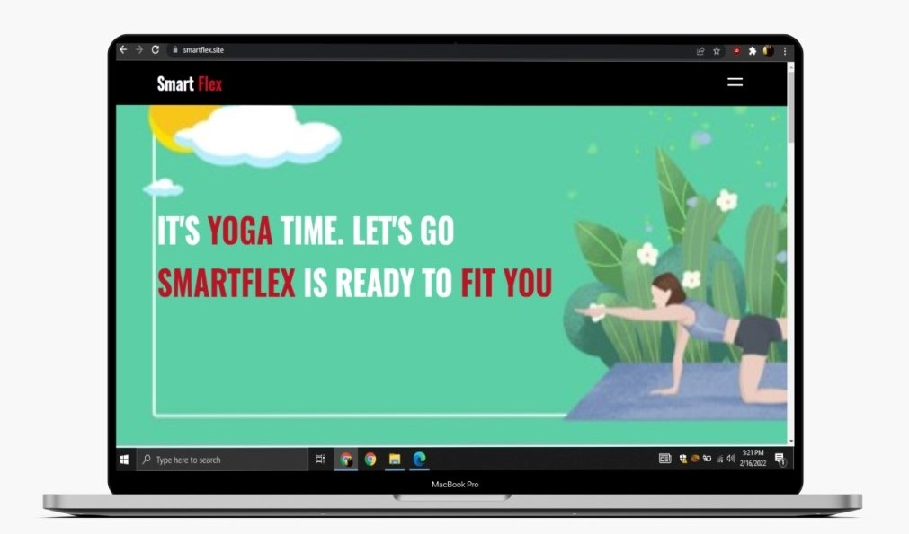
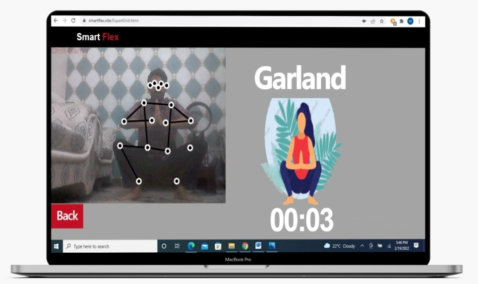

# SmartFlex – AI Yoga Web Application  

**SmartFlex** is a browser-based yoga coaching app using pose estimation and machine learning to guide users in performing yoga poses with feedback and tracking.

---

## 📸 Screenshots  

### Home Page  
  

### Pose Detection (Garland Pose)  
  

---

## 🛠️ Tech Stack  

- **Frontend**: HTML, CSS, JavaScript  
- **Machine Learning**: TensorFlow.js, ml5.js, PoseNet  
- **Backend**: PHP, SQL Database  
- **Libraries**: P5.js for creative visualization  
- **Hosting**: Compatible with AwardSpace or local Apache servers  


---

## ✨ Features  

- 📹 **Real-time Pose Detection** – Detects yoga poses using trained ML models.  
- 🧘 **Supported Poses** – Mountain, Garland, Goddess, Warrior I, Warrior II, Triangle.  
- 🎯 **Training Modes** – Beginner/Practice Mode, Expert Drill.  
- 🔐 **User Accounts** – Signup, login, logout, and password recovery.  
- 📬 **Contact Form** – Feedback and communication support.  

---

## 🔧 Setup & Usage  

### Prerequisites  
- PHP environment (e.g. XAMPP, WAMP, or any Apache/Nginx server with PHP).  
- Browser with webcam access enabled.  

### Steps  

```bash
# Clone the repository
git clone https://github.com/DevKhanHassam/Smartflex.git
